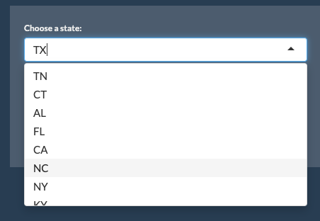
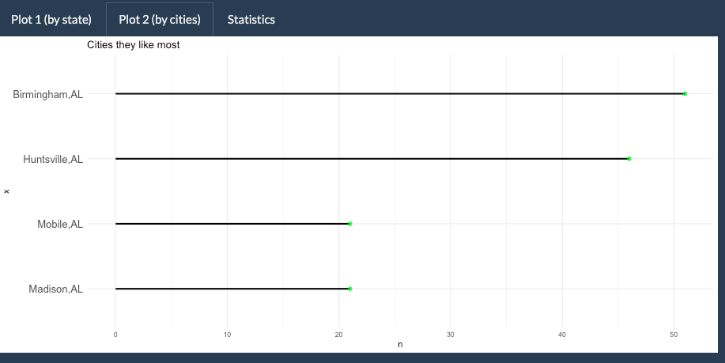
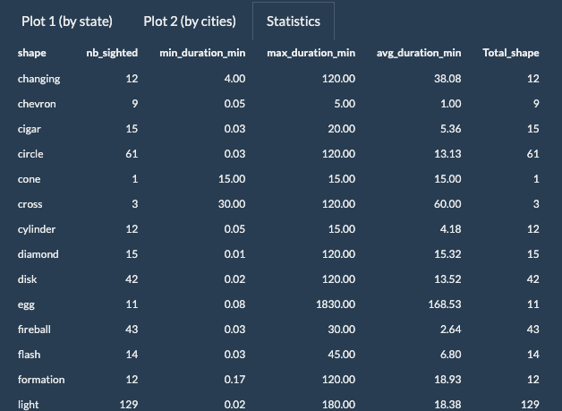
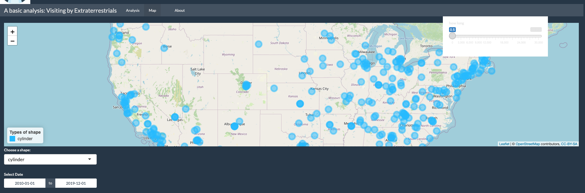
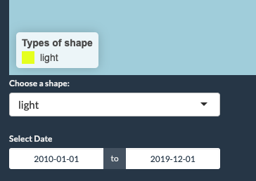
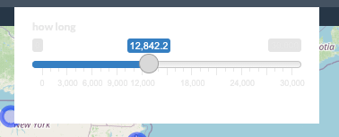
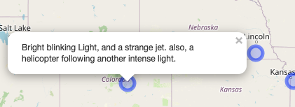
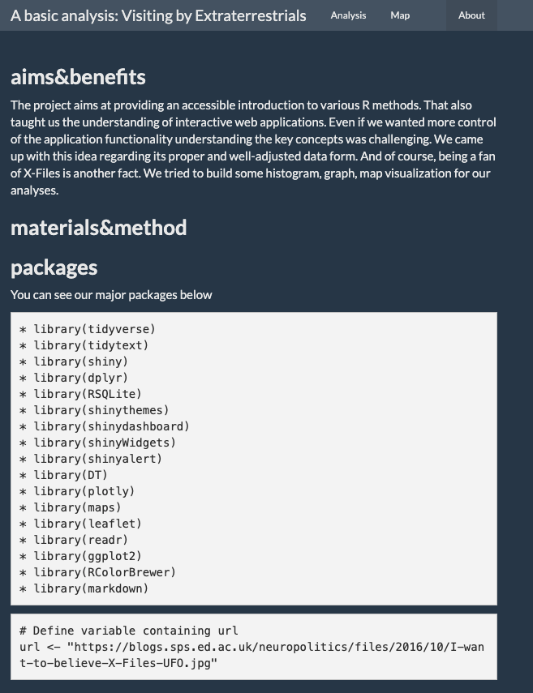

==============================================================================

### **About**

**title:**  *A basic analysis: Visiting by Extraterrestrials*

**author:**  Evrim Bilgen 


### **aims&benefits**

The project aims at providing an accessible introduction to various R methods. That also taught me the understanding of interactive web applications. Even if I wanted more control of the application functionality understanding the key concepts was challenging.
I came up with this idea regarding its proper and well-adjusted data form. And of course, being a fan of X-Files is another fact. 
I tried to build some histogram, graph, map visualization for our analyses.

  
###  **materials&method**

  * Writing own functions in R
  * Advanced data processing with dplyr,dtplyr,tidyr
  * Automation of scripts and reports (RMarkdown)
  
### **packages**

You can see our major packages below


    * library(tidyverse)
    * library(tidytext)
    * library(shiny)
    * library(dplyr)
    * library(RSQLite)
    * library(shinythemes)
    * library(shinydashboard)
    * library(shinyWidgets)
    * library(shinyalert)
    * library(DT)
    * library(plotly)
    * library(maps)
    * library(leaflet)
    * library(readr)
    * library(ggplot2)
    * library(RColorBrewer)
    * library(markdown)
    * library(knitr)
    
    
###  **References**


  * shiny.rstudio.com
  * medium.com
  * nielsvandervelden.com
  * kaggle.com
  * stackoverflow.com
  * towardsdatascience.com
  * Datacamp courses and case studies
  * the National UFO Reporting Center
  * bookdown.org
  * nestacms.com/docs/creating-content/markdown-cheat-sheet
  * jiashenliu.shinyapps.io/PokemonGo


## Let's meet our data

Our data is provided by the National UFO Reporting Center including USA states.


```{r, echo=TRUE}
library(dplyr)
ET <- read.csv("./Data/ETdata.csv", header=TRUE)

glimpse(ET)
```

As you can see that our data have 8 columns. And below, you can see the top 10 rows; describing in which state was visited by UFO and which cities were they and what they were like exactly.


```{r, echo=FALSE}

ET <- read.csv("./Data/ETdata.csv", header=TRUE)
head(ET, nrow = 10)
```


Our first analysis tab includes first plot. And also there are two inputs, one button on the left side.

We built this structure using navbarpage including 3 tabpanels and their inputs

<center>




Our first plot is representing the number of visits as the type of shape depending on the state and date information.



The second plot is presenting cities that UFO visited mostly in the chosen state.(above)



And the last tab is about general statistics information depending on the state and date information and some calculation about the shapes.


Here below, you can see basic calculations such as min, max, the average duration of the seeing shapes.


```{r, echo=TRUE}

ET %>%
      filter(
        state == 'AL',
        date_sighted >= '2010-01-01',
        date_sighted <= '2020-01-01'
      ) %>%
      group_by(shape) %>%
      summarize(
        nb_sighted = n(),
        min_duration_min = min(duration_sec) / 60,
        max_duration_min = max(duration_sec) / 60,
        avg_duration_min = mean(duration_sec) / 60,
        Total_shape = length(shape)
      )
```


Now, we see our second tab panel. Mapping with leaflet was a great way to show our data interactively. 


For controlling the result; You can select a shape that listing in the input and also pick a date for more specific results





In addition to these, you can also determine duration by using the slider input on the right top of the map. This input explains the shape that you chose how long it had been seen.




We also preferred to use **add legend** property in our leaflet code chunk for separated the shapes using different colors.


      color <- colorFactor(topo.colors(15), Data$shape)

      output$map <- leaflet::renderLeaflet({
      byduration() %>%
      leaflet() %>% 
      addTiles() %>%
      setView( -98.58, 39.82, zoom = 5) %>% 
      addTiles() %>% 
      addCircleMarkers(popup = ~ comments, stroke=TRUE, fillOpacity=0.5,
                       color=~color(shape)
          ) %>%
          addLegend(
            "bottomleft",
            pal=color,
            values=~shape,
            opacity = 1,
           title="Types of shape")
           

When you click on those shapes by mouse icon, you can see the popup comment including some information about the exact shape.




Now we are heading on our last tab panel which is actually including a **R Markdown** file. (also this HTML presentation )
This RMarkdown file aims mainly at the aspect of the shiny app besides some instructions about how you can use this app efficiently. And of course, you can also find information about the project, code and us.



###  **Thanks for your attention**
###  **The truth is out there**
